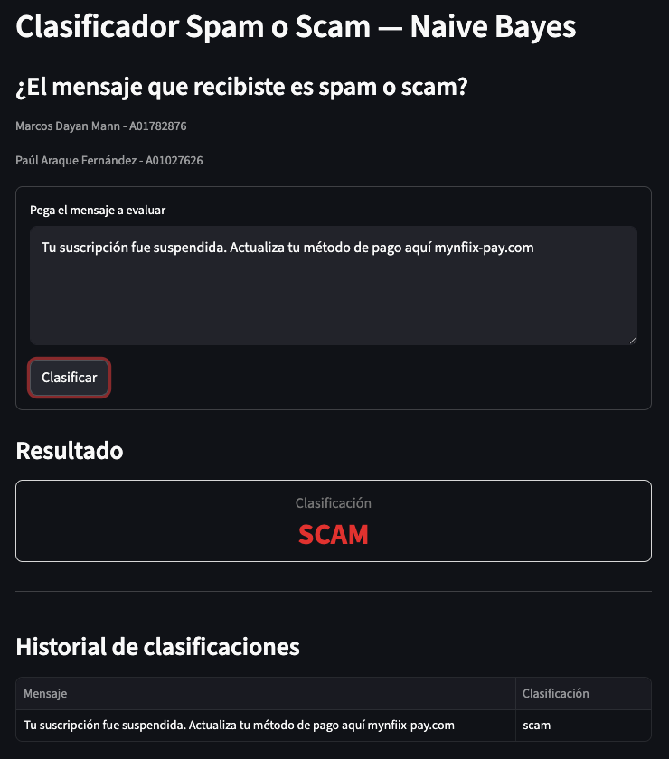

# Naive Bayes SPAM/SCAM classifier

In Mexico, it is very common to receive suspicious messages from unknown or sketchy sources. This project builds a text classification pipeline to automatically detect spam and scam messages.

# Setup

## Install dependencies with your favorite packae manager

### Using uv

In this case, I'm using uv as my package manager

See [uv docs](https://docs.astral.sh/uv/#installation)

### Using pip

For using pip as the package manager, run `pip install -r requirements.txt`

## Create dataset from crude data

Run `python preprocessing.py`

This script will take `data/crude_data.csv` spam/scam dataset to preprocess it, parsing and cleaning the text, to then create a `data/dataset.csv` clean file and a `data/train.csv`, and finally a `data/test.csv` crude data file

## (Optional) Visualize dataset insights

Run `python dataset_insights.py`

This script will display some insights of the dataset and its distribution

## Train Naive Bayes ML model with training data

Run `python nb.py`

This script will train a NB model with the `data/train.csv`, and then store as compiled objects the TF-IDF vectorizer and the NB model for production use

## (Optional) Visualize model insights

Run `python model_insights.py`

This script will perform a K-fold cross validation with the dataset and will evaluate the model based on its Precision, Accuracy, Recall, F1, ROC, AUC, and the Confusion matrix. It will also how the most significative tokens gotten by the TF-IDF vectorizer for SPAM and SCAM

## Run user interface

Run `streamlit run app.py`

This script uses `streamlit` library to spin a user interface in which the user can test the model, and see the session historic classifications.
